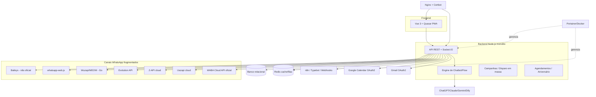

# RE_ANALISE — Engenharia Reversa do ZPRO

> Fase 2. Reconstrói o mapa do sistema de referência (ZPRO) a partir do `SUMARIO_INSUMOS.md`.
> Objetivo: extrair o que copiar, o que evitar e onde o **unibot** ganha.

---

## 1. Arquitetura inferida

**Padrão arquitetural:** monolito Node.js com Socket.IO, multi-tenant por isolamento de pastas/registros (`sessions/tenantN`), frontend PWA separado. Integração de canais feita por **adaptadores acoplados** — cada API tem seu próprio caminho de código (origem da fragmentação).

**Tecnologias confirmadas:** Node.js, Vue 3/Quasar, Redis, banco relacional, Nginx, Docker+Portainer, deploy via shell autoinstalador em VPS Ubuntu.

---

## 2. Domínios funcionais (o "quê" — copiar conceitualmente)

| Domínio | Capacidades |
|---------|-------------|
| **Atendimento** | Tickets, filas/setores, transferência, convite a atendimento, transbordo bot→humano, presence (digitando/gravando), avaliação pós-atendimento |
| **Multicanal** | WhatsApp (7 APIs), Instagram, Messenger, Telegram, E-mail/Gmail, Webchat, TikTok, YouTube, ML, OLX |
| **Chatbot/Flow** | Flowbuilder visual; ações (criar oportunidade/evento/nota, agendar msg, webhook, SMS, vapi, definir demanda); condições (igual/contém/começa/termina/regex); captura de variáveis `{var}`; transbordo + IA |
| **CRM/Vendas** | Contatos+tags, funil/Kanban de oportunidades (funil + etapa), Google Calendar ligado a oportunidades |
| **Campanhas** | Disparo em massa com variáveis, paginação, agendamento, mensagem de aniversário/despedida |
| **IA** | ChatGPT/Claude/Gemini/Dify; reescrita por idioma; qualificação de leads |
| **WABA oficial** | Templates, catálogo/produtos, ligações (SIP/WAVOIP), webhooks keep-alive |
| **Multi-tenant/Revenda** | Superadmin, masterkey, force logout, limitar canais por tenant, export de empresas, gateway de pagamento |
| **White-label** | Cores/logo/tipografia, dark mode, domínio próprio, 8 temas de login |
| **Integrações** | n8n (webhooks padronizados), Typebot, webhooks bidirecionais, API REST |

---

## 3. Regras de negócio críticas observadas

- **Multi-tenant com isolamento por pasta** de sessões (`sessions/tenant1/1`) — frágil para escala.
- **Janela de conversa global** (não por ticket) para WABA/hub — regra de cobrança/limite da Meta.
- **Chatbot inativo não dispara palavra-gatilho** (correção recorrente → regra sensível).
- **Masterkey**: superadmin loga como qualquer usuário sem senha — poderoso e perigoso (auditoria?).
- **Licenciamento**: 1 domínio principal/licença (fim dos domínios ilimitados em ago/2025), proibição de revenda não autorizada, suspensão automática sem aviso.

---

## 4. Pontos fracos do ZPRO (⇒ oportunidades do unibot)

| # | Dor crônica observada no changelog | Oportunidade para o unibot |
|---|-------------------------------------|-----------------------------|
| 1 | **Instabilidade da Baileys**: trocou de fork 3+ vezes, breaking change quase toda versão, reler QRCode constante | **Camada de canal unificada** com health-check, reconexão automática e fallback entre provedores; tratar a API não-oficial como plugin isolado |
| 2 | **Updates manuais e perigosos**: "faça backup/ponto de recuperação", substituir pasta no root, breaking change recorrente | **CI/CD + migrations versionadas + deploy zero-downtime**; updates idempotentes e reversíveis |
| 3 | **Gambiarra em `node_modules`**: editar `redis-parser/parser.js`, comentar linhas, forks pessoais | **Forks/abstrações próprias mantidas**; nunca patch manual em produção |
| 4 | **Fragmentação multi-API**: "correções gerais uazapi/zapi" toda semana, cada canal com bug próprio | **Driver de canal com contrato único** (interface comum send/receive/status); testes de contrato por provedor |
| 5 | **Vazamentos de memória / CPU / Redis** | Observabilidade desde o dia 1 (métricas, limites, backpressure nas filas) |
| 6 | **Deploy artesanal** (nginx/certbot/pm2 manual, Portainer clique-a-clique) | **Docker Compose 1-comando** (MVP) e **k3s+GitOps** (escala) — ver `INFRA_PLAN.md` na Fase 4 |
| 7 | **Migração Vue 2→3 dolorosa** (meses de develop instável) | Nascer já em stack moderna e única, sem dívida de framework |
| 8 | **Licenciamento hostil a revendedores** (suspensão sem aviso, fim de ilimitado) | **Modelo de revenda amigável e previsível**: onboarding self-service, licença clara, sem armadilhas → diferencial comercial direto |
| 9 | **Sem self-service de instalação** (download em área de membros, suporte manual) | **Onboarding automatizado**: provisionamento de tenant em minutos, instalador guiado/cloud |

---

## 5. O que o unibot deve preservar (forças do ZPRO que funcionam)

- Amplitude de canais e a ideia de **suportar API oficial WABA + alternativas**.
- Flowbuilder visual com ações ricas e captura de variáveis.
- Modelo **self-hosted + white-label + revenda** (é o que o público paga e o posicionamento escolhido).
- CRM/funil integrado ao atendimento (não como produto separado).
- IA plugável (múltiplos provedores) — já é padrão de mercado.

---

## 6. Síntese estratégica para o unibot

> **Modelo de negócio (definido):** o unibot **não** é uma licença white-label vendida a desenvolvedores (modelo ZPRO). É um **SaaS multitenant operado pelo próprio Bruno**, vendido por **assinatura direto à empresa-cliente final** (modelo de go-to-market do Jetsales). Cada *tenant* = uma empresa-cliente que consome a plataforma.
>
> **Tese:** o ZPRO vende *amplitude* mas sofre de *fragilidade operacional* e é só infraestrutura para revendedores. O Jetsales vende *simplicidade e go-to-market afiado*, mas é *raso* (só WhatsApp).
>
> O **unibot** ocupa o meio premium: **amplitude e capacidade tipo ZPRO** (multicanal, chatbot, CRM, multitenant) entregues como **SaaS gerenciado e estável tipo Jetsales**, sem o cliente precisar tocar em VPS, update ou Baileys. As dores nº 1–7 (estabilidade, deploy, fragmentação de canais) deixam de ser problema *do cliente* e viram **responsabilidade operacional do unibot** — é exatamente isso que justifica a assinatura recorrente.
>
> **Não se aplica:** o diferencial nº 8 (revenda amigável a desenvolvedores) — o unibot vende ao consumidor final, não a revendedores. O multitenant existe para o **operador (Bruno)** servir muitas empresas, não para terceiros revenderem.

---

## Gaps que só fecham com mais insumo (opcional)

- Captura de tráfego (HAR) de uma sessão própria do ZPRO → contratos de API exatos.
- Acesso a um trial/demo → modelo de dados real, nomes de telas.
- Conversas com suporte → roadmap não publicado.

*(Não bloqueiam o avanço para a Fase 3 — design do unibot.)*
